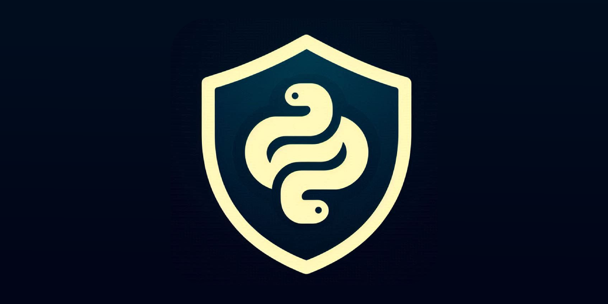

<a id ="up"></a>

<p align="center">


</p>

---
### 🛡Py-Sheild🛡
Tool/Library for Python used to obfuscate and protect your code from decompilation, reverse debug, etc. Also, can prevent detection by antiviruses.

---
### 💻Supported Platforms💻

- Python 3
- Windows
- Various Linux distributions
- Mac OS

---
### 🔧Main Features🔧
> **Hash strings**
> - Hashing all strings in piece of code. It replaces all strings with their hash.
> - Protects strings context.

> **Looping obfuscation**
> - Encrypting piece of code using base64 and zlib for N times.
> - Best way to decrease/prevent antiviruses detection.

> **AES encryption**
> - Encrypting piece of code using AES 256 encryption algorithm.
> - One of two nice ways to protect code from deobfuscation.

> **Fernet encryption**
> - Encrypting piece of code using Fernet encryption algorithm.
> - One of two nice ways to protect code from deobfuscation.
---

### 🏁Quick start🏁
1. Clone repo
    ```
    git clone https://github.com/ByteCorum/Py-Sheild.git
    ```
2. Install requirements
   ```
   pip install -r requirements.txt
   ```
3. More info
   ```
   py-sheild --help
   ```
4. Example
    ```
    py-sheild --mode hashstr;crypt;looping;aes --loops 3 main.py
    ```
5. Output
   ```
   from PySheild.script_67158430 import PySheild
   PySheild(b'x\x9c\x05\xc1I\xa2C0\x00\x00\xd0\x03Y\x18\xd3a\xa9\x9a\xf0Q\xc4\\;TEM\r...')
   ```
6. Example legacy
    ```
    py-sheild-legacy --loops 3 --mode 2 --file main.py
    ```
7. Output legacy
   ```
   _=lambda __:__import__('zlib').decompress(__import__('cryptography.fernet').fernet.Fernet(((__import__('zlib').decompress(__))[::-1].split(b'/%p@K^(Y#C/_/jUEIakSX%/'))[1]).decrypt(((__import__('zlib').decompress(__))[::-1].split(b'/%p@K^(Y#C/_/jUEIakSX%/'))[0])[::-1]);exec((_)(b'x\x9c\x15\x...')
   ```

---

### 📜Additional Info📜
Global version is still in dev, but you can use legacy version. Note that it's less safe than global version.

> [!TIP]
> We highly recommend compiling obfuscated script using Nuitka. Use `--follow imports` while obfuscating to tell Nuitka what to import

> [!WARNING]  
> Script won't run if u use `if __name__ == "__main__"` in main file(we are working on it)

> [!NOTE]  
> If you want to try global version, just uncomment `self.AssembleExecutor(dirPath)` in `obfuscate.py`. Currently it only works with single file projects.
---

### 📲Contacts

<a href="https://github.com/ByteCorum"></a>
   <a href="https://discordapp.com/users/798503509522645012"></a>
---

[⬆go up⬆](#up)
