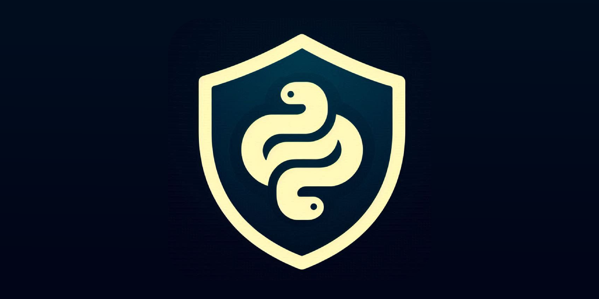

<a id ="up"></a>

<p align="center">



</p>

---

### 🛡.PyGuard🛡

Tool/Library for Python used to obfuscate and protect your code in static and runtime from decompilation, reverse debug, etc. Also, can prevent detection by antiviruses.

---

### 💻Supported Platforms💻

-   Python 3 up to latest
-   Windows
-   All Linux distributions
-   Mac OS

---

### 🔧Main Features🔧

> **Static & Runtime Protection**
>
> -   Total advanced static and runtime protection from decompilation, reverse debug, etc.

> **Hash Variables**
>
> -   Hash all variables and constants values in fragment of code.
> -   Protects variables and constants content.

> **Recursive obfuscation**
>
> -   Recurseve encrypt fragment of code using base64 and zlib n times.
> -   Best way to decrease/prevent antiviruses detection.

> **Best encryption algorithms**
>
> -   Fernet, AES-GCM, ChaCha20, Salsa20
> -   Symmetric cipher which offer strong confidentiality, and provide authentication and integrity to protect against tampering.

> **File Integrity Protection**
>
> -   Protect files against modification.
> -   Advanced file hash/content integrity check and comparison.

---

### 🏁Quick start🏁

1. Clone repo
    ```
    git clone https://github.com/ByteCorum/.PyGuard.git
    ```
2. Install requirements
    ```
    pip install -r requirements.txt
    ```
3. Usage info
    ```
    .pyguard --help
    ```
4. Example
    ```
    .pyguard obfuscate --hashdata --aes --chacha --follow-imports main.py
    ```
5. Output
    ```
    #Obfuscated by .PyGuard 3.1.0.0
    from DotPyGuard.script_55958136 import DotPyGuard, _
    _(DotPyGuard(b'x\x9c\x05\xc1\xc7\xa2k@\x00\x00\xd0\x0f\xb2P\xa3,\xdeB\...')
    ```
6. Example legacy
    ```
    .pyguard obfuscatelegacy --loops 3 --mode 2 --file code.py
    ```
7. Output legacy
    ```
    _=lambda __:__import__('zlib').decompress(__import__('cryptography.fernet').fernet.Fernet(__import__('base64').b64decode(((__import__('zlib').decompress(__))[::-1].split(b'eY3NTTr:S|dD'))[1])).decrypt(((__import__('zlib').decompress(__))[::-1].split(b'eY3NTTr:S|dD'))[0])[::-1]);exec((_x)(b'x\x9c\x15\x97U\xce\x86\...')
    ```

---

### 📜Additional Info📜

> [!NOTE]  
> Obfuscation tool has 2 major versions legacy and main. This repo includes both of them, but we highly recommend you to use the main version, cuz it much more secure. Anyway, we won't end support of legacy version, so if u have issues, let us know.

> [!TIP]
> We highly recommend compiling obfuscated script using Nuitka. Use `--follow imports` while obfuscating to tell Nuitka what to import

---

### 📲Contacts

<a href="https://github.com/ByteCorum"></a>
<a href="https://discordapp.com/users/798503509522645012"></a>

---

### 💸Support

<a href="https://ko-fi.com/bytecorum"></a>

---

[⬆go up⬆](#up)
